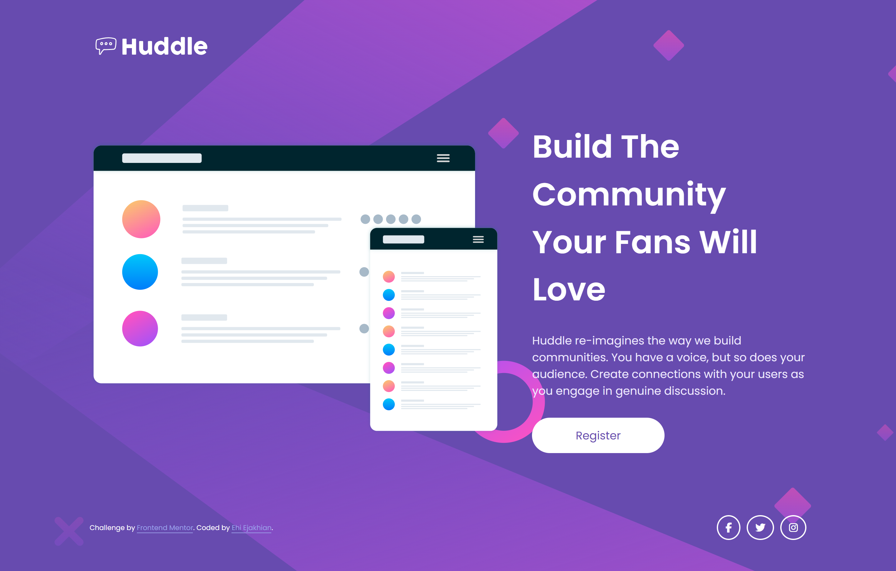

# Frontend Mentor - Huddle landing page with single introductory section solution

This is a solution to the [Huddle landing page with single introductory section challenge on Frontend Mentor](https://www.frontendmentor.io/challenges/huddle-landing-page-with-a-single-introductory-section-B_2Wvxgi0). Frontend Mentor challenges help you improve your coding skills by building realistic projects. 

## Table of contents
- [Me](#meet-me)
- [Screenshot](#screenshot)
- [My process](#my-process)
  - [Built with](#built-with)
  - [What I learned](#what-i-learned)
  - [Continued development](#continued-development)
- [Author](#author)
- [Thanks](#thanks)


## Meet Me
Good day. I'm Ehi. I'm an aspiring developer from Edo, Nigeria. I took this challenge. Here's how I did it and thanks for reading!

## Screenshot

The Challenge

My Desktop design

## My process
After my HTML, I start styling with padding. I set the margin of all elements to zero and then give all elements borders. This helps me visualize all element boundaries - all this I do without adding any color.

Then, I add color, backgrounds and border radii to the assigned elements. I prefer using Comic Sans MS or Comic Relief as my font during design because it feels relaxing to my eyes and it helps me think better. I can't explain it though, it's just a feeling.

Funny and weird, right?😁

With SASS, I create mixins and partials to modularize my code. It helps me think and scroll through code with a simple mind.


### Built with

- Semantic HTML5 markup
- CSS custom properties
- Flexbox
- SASS
- Mobile-first workflow


### What I learned

This is my first time using font Awesome icons. I learned how to create a kit and reference it using the ```script```  tag provided by font awesome. It was fun!

### Continued development

I had some problems though with the background of the desktop screen sizes. I set the size to contain and cover many times just to try get the design. It almost ruined me. I want to get better at that next time.


## Author
For now I don't have a website of my own, but I am working on having one soon. It's very important.
- Frontend Mentor - [@EhiEjakhian](https://www.frontendmentor.io/profile/EhiEjakhian)
- Chat me on Whatsapp - [Ehi Ejakhian](https://wa.me/+2348142340182?text=Hello%20Ehi%20.%20I%20checked%20your%20Huddle%20landing%20page%20with%20single%20introductory%20section%20solution!)
- LinkedIn - [Ejakhian Ehi](https://ng.linkedin.com/in/ehi-ejakhian-2302a7318)

I'm also an aspiring comic and sketch artist, so if you have any gigs or if you can relate, check me up on whatsapp and see my art.

# Thanks!
Thank you for going through this. I really hope I did good to your taste, if not please tell me how to improve on the comments section of my solution. Thanks again!
